# DeerID Photo-to-Profile Process Flow

**Updated:** August 11, 2026
**Scope:** Most current agreed flow from field capture through human-confirmed deer-profile assignment.
**Status key:** ✅ Operational now · 🧪 Operational but calibration-locked · 🧭 Planned · 🔬 Research-grade

## Verdict

**HARD-BUT-DOABLE:** The field-to-review and human-triggered HD pipeline is operational. Gate 1B male/antler triage now runs locally with append-only model evidence, three review queues, human attribute corrections, and a recall gate that keeps female-only bulk suppression locked until local labels pass validation. Individual-deer re-identification remains a future, human-confirmed open-set retrieval process—not autonomous profile classification.

## End-to-end flow

```mermaid
flowchart TD
    A[Field camera trigger] --> B{Capture source}

    B -->|Reveal cellular camera — current| C[Reveal cloud thumbnail + provider metadata]
    B -->|Future DeerID field node / Route C| D[Blind: stable animal-vs-blank filter]
    D -->|Animal-containing event| E[Durable local queue and upload]
    D -->|Likely blank| D1[Retain/audit locally per policy]
    E --> F[Base receives original media + metadata]

    C --> G[Scheduled or manual Reveal ingestion]
    G --> H[Verify image bytes, type, dimensions and SHA-256]
    F --> H
    H --> I[Private Supabase Storage + searchable catalog]
    I --> J[Preserve raw provider metadata, camera, time, GPS, weather and telemetry]

    J --> K[Gate 1: SpeciesNet 4.0.3a]
    K --> L[Stable camera/time event grouping]
    L --> M{One best representative per event}
    M -->|Target deer| N[Review candidate]
    M -->|Uncertain animal or model failure| N
    M -->|Confident non-target| O[Archive]
    M -->|Blank / below threshold| O
    M -->|Lower-value burst frames| P[Event duplicates retained]

    N --> Q[Gate 1B: independent attributes]
    Q --> Q1[Species]
    Q --> Q2[Visible antler]
    Q --> Q3[Probable male]
    Q --> Q4[Head visibility]
    Q --> Q5[Animal count / mixed group / all assessed]
    Q --> R{Recall-preserving event triage}

    R -->|Any positive male or antler evidence| S[Primary / likely-male queue]
    R -->|Hidden head, mixed group, disagreement or failure| T[Uncertain queue]
    R -->|Every target animal clearly assessed with no male evidence| U[Female-only candidate]
    U --> U1[Suppress from routine queue only after calibration]
    U1 --> U2[Versioned audit sample]

    S --> V{HD needed?}
    T --> V
    U2 --> W[Human audit/correction]
    V -->|Yes: automatic policy or human Request HD| X[Durable fenced HD request]
    V -->|No: thumbnail is sufficient for decision| Y[Human review]

    X --> X1[Reveal batch HD request]
    X1 -->|Explicit acknowledgement| X2[Submitted]
    X1 -->|Explicit refusal| X3[Failed; safe retry allowed]
    X1 -->|Timeout/crash/ambiguous response| X4[Unknown; do not auto-retry]
    X2 --> X5[Later ingestion detects hdPhoto=true]
    X4 --> X5
    X5 --> X6[Download and verify returned HD media]
    X6 --> X7{Real quality gain?}
    X7 -->|No / malformed / not improved| X8[Retain evidence and flag for review]
    X7 -->|Yes| AD[HD animal-instance detection]
    X8 --> Y[Human exception review]

    AD --> AD1[One immutable child crop per visible deer]
    AD1 --> AD2{Detection complete and separable?}
    AD2 -->|Yes| AE[Versioned HD model pass per animal instance]
    AD2 -->|Overlap, missed deer, or ambiguous boundary| Y1[Human correct boxes / split / mark inseparable]
    Y1 --> AE
    AE --> AE1[Identity quality + age-class assistance + antler-score eligibility]
    AE1 --> AG[Cue-specific crops and embeddings]
    AG --> AG1[Full body]
    AG --> AG2[Head / face / ears]
    AG --> AG3[Antlers]
    AG --> AG4[Axis left flank]
    AG --> AG5[Axis right flank]
    AG --> AH[Open-set profile retrieval]
    AH --> AI[Top-k existing profiles + unknown/new option]
    AI --> Y[Human reviews one deer crop at a time with full-frame context]

    Y --> Z{Human decision}
    Z -->|Pass for identity| X[Request HD if not already available]
    Z -->|Confirm existing profile| AM[Append confirmed media assignment]
    Z -->|Create new deer| AN[Create animal + season appearance profile]
    Z -->|Not useful| AB[Resolve review; retain archived evidence]
    Z -->|Defer| AC[Leave unresolved for later review]

    AM --> AR[Update profile evidence view]
    AN --> AR
    AR --> AS[Human-confirmed named deer profile]
```



## Current implementation boundary

### ✅ Operational now

1. **Reveal cloud ingestion**
   - Retrieves cloud-synced media and provider metadata.
   - Verifies image format, dimensions, byte count and SHA-256.
   - Stores image, original metadata and checksum completion marker in private Supabase Storage.
   - Catalogs camera, capture time, GPS when supplied, weather, battery, signal and provenance.
   - Repeated syncs are duplicate-safe; an HD upgrade causes the media to be fetched and cataloged again rather than mistaken for the completed thumbnail.

2. **Gate 1 screening and event grouping**
   - SpeciesNet `4.0.3a` supplies animal/species evidence.
   - Current events use a stable camera/time grouping and retain a single best review representative while keeping lower-value burst frames as event duplicates.
   - Target deer, uncertain animals and model failures go to review.
   - Confident non-targets and blank/below-threshold captures remain archived.
   - Model evidence and routing reasons are versioned and append-only.

3. **Human review and profile actions**
   - **Pass → Request HD:** the single positive quick action atomically reserves the review, calls Reveal, records the provider outcome and marks the event as continuing toward the identity path. There is no separate “Keep for ID” button.
   - **Not useful:** resolves the review without deleting the archived media.
   - **Defer:** leaves the item unresolved so it can be reviewed later.
   - Quick actions render immediately beside/below the current image; editable model attributes and profile controls remain below them so routine review does not require scrolling away from the photo.
   - **Create new deer profile:** idempotently creates a long-lived animal plus the capture-year appearance profile and appends the current image as human-confirmed evidence; retries return the same profile.
   - **Add photo to profile:** appends an immutable assignment event to a compatible capture-year profile. `animal_media` is only the current relationship projection; every prior model/import/human state and actor is preserved in the append-only assignment ledger before that projection changes.
   - Decisions and profile writes are tied to a specific Gate 1 assessment and review version. Fresh items lazily initialize that state, while stale browser actions cannot overwrite a newer decision.

4. **HD request, retrieval, and continuation state machine**
   - States: `queued → requesting → submitted → available`, with `failed`, `unknown` and `cancelled` side states.
   - A request token fences each provider call and prevents stale workers from finalizing newer work.
   - Only an explicit, structurally valid Reveal acknowledgement becomes `submitted`.
   - An ambiguous provider outcome becomes `unknown` and is **not automatically replayed**, avoiding duplicate billable requests.
   - A later catalog sync reconciles `submitted`, `unknown` or other pending states when Reveal reports `hdPhoto=true`.
   - Reveal’s stable provider photo ID keeps the HD response on the original `media.id`, so its Gate 1 assessment, human review, event and profile evidence remain connected.
   - The original thumbnail and returned HD object are retained as append-only `media_assets` under that identity. The HD asset does not enter thumbnail SpeciesNet/Gate 1 intake again.
   - An HD arrival queues separate quality, age, antler-score, distinguishing-attribute, embedding and re-identification stages. Those jobs are now explicit durable continuation work; model implementations beyond quality/eligibility remain future-state.

### ✅ Operational model routing and returned-HD review

**Gate 1B** runs after stable event grouping and before HD retrieval. The self-hosted base executes pinned local `gemma4:e4b` every 15 minutes. By explicit owner decision, the exact pinned model now has operational routing authority even though local accuracy remains unvalidated:

- **Likely male:** any positive visible-antler or probable-male evidence automatically creates one replay-idempotent HD request and resolves thumbnail review.
- **Uncertain:** partial/hidden heads, mixed groups, unassessed animals, ambiguity, malformed output or model failure remain in the primary human thumbnail queue.
- **Female candidate:** target deer only, every animal assessable, full head visibility, and no positive male/antler evidence is filtered without an HD request.

Every automatic request/filter is preserved in `gate1b_automation_events`, separately from the immutable prediction. The **Automation audit** workspace exposes both automatic strata. A reviewer can mark filtered images **Should have requested HD**, mark requested images **Incorrect male / antlers**, or affirm either as correct. Corrections append to a separate label ledger and never rewrite model evidence.

Returned HD is retained as a distinct immutable asset under the original capture identity. The local returned-HD worker records conservative species/sex, identity eligibility, age eligibility/class, antler-score eligibility/range, distinguishing features, and a summary. Unsupported age or score stays `unknown`. The **Returned HD** workspace is the normal future human loop: create a season profile, match an existing profile, or mark the image not identity-worthy. Human profile identity remains authoritative.

The model is operational by owner-authorized override, **not because it passed the former validation gate**. Accuracy, missed bucks, and unnecessary HD requests must be measured from the append-only audit labels.

### 🧭 Planned next

1. Accumulate automatic-routing audit labels across all cameras, species, day/color and IR, and report every missed buck and unnecessary HD request.
2. Add a dedicated HD animal-instance detector before returned-HD identity review. It must emit one versioned bounding box (and optional mask) per visible deer, generate one immutable child crop per detection, and create one review item per animal instance while retaining the full HD frame as context. The reviewer must be able to add a missed deer, resize a bad box, split a merged detection, or mark overlapping animals inseparable. No full-frame profile assignment is allowed when more than one deer is present.
3. Add reproducible cue crops, embeddings, and ranked open-set profile candidates to each animal-instance result; current review supports profile creation/matching but does not yet compute similarity candidates.
4. Calibrate or replace the operational model from observed mistakes while preserving exact model/prompt lineage.
5. Add explicit technical and task gates:
   - `identity_eligible`
   - `age_eligible`
   - `spread_eligible`
   - `beam_tine_eligible`
   - axis left/right-flank eligibility
6. Queue identity-worthy per-animal evidence for future embeddings and candidate retrieval.

### 🔬 Future re-identification process

Re-ID will be **open-set retrieval with human confirmation**, not a classifier that must force every photo into an existing name.

1. Detect each animal independently; never assign one event-level identity to every deer in a group photo.
2. Treat the detector output as an **animal instance**, not an identity. Each instance gets its own child crop, review state, quality flags, candidate set, and eventual profile decision, all linked back to the same immutable HD parent frame.
3. Create reproducible, cue-specific crops and embeddings rather than one irreversible “master embedding.” Preserve crop coordinates, padding, detector/model version, and source-asset hash so every crop can be regenerated.
4. Search compatible season/stage galleries and return ranked top-k candidates.
5. Keep model similarity, calibrated match probability and human confirmation as separate fields.
6. Let the reviewer:
   - confirm an existing deer;
   - reject one or more candidates;
   - create a new deer when none match;
   - leave the animal unknown when evidence is insufficient;
   - merge duplicate identities or split a contaminated profile.
7. Append every assignment/correction. Never overwrite raw media, model outputs or decision history.
8. Maintain one long-lived animal record with season/stage-scoped appearance profiles because coat, body, injuries and antlers change over time.

### Multi-animal HD review contract

- **Unit of identity review:** one detected deer instance/crop, never the whole group photo.
- **Context:** show the selected crop prominently and the full HD frame with that animal's box highlighted; allow switching among `Animal 1`, `Animal 2`, and so on.
- **Independent outcome:** each animal can be matched to a different existing capture-year profile, create a different new profile, be rejected as identity-poor, or remain unknown/deferred.
- **Shared provenance:** all child crops point to the same parent HD asset/event, but no identity decision propagates from one crop to another.
- **Duplicate control:** detections across burst frames may later be track-linked for reviewer convenience, but tracking must not silently collapse two nearby deer or auto-assign identity.
- **Failure behavior:** detector uncertainty, overlap, or a disagreement between animal count and boxes routes to box-correction review before re-ID; it never drops the extra deer.

## Human decisions and their downstream triggers

| Human decision | Immediate effect | Downstream trigger |
|---|---|---|
| **Pass → Request HD** | Safely records the provider request and resolves the thumbnail review only after the outcome is fenced | Verified HD retrieval → HD model pass → age/score assistance + top-k identity candidates → human HD review |
| **Not useful** | Resolves the review | No re-ID or measurement work; immutable evidence remains in archive |
| **Defer** | Keeps the review unresolved | Item returns for later human decision; no billable or identity side effect |
| **Correct Gate 1B attributes** | Stores human labels separately from model output | Validation metrics, threshold calibration and future training data |
| **Confirm existing profile** | Appends a human-confirmed media-to-appearance-profile assignment | Profile evidence/history updates; confirmed sample may enter future gallery builds |
| **Reject candidate** | Records that a suggested match was wrong | Candidate score remains auditable; no confirmed profile change |
| **Create new deer** | Creates a long-lived animal and current season/stage appearance profile | Current evidence becomes the seed for later retrieval |
| **Unknown / insufficient evidence** | Avoids a forced false match | Await another angle/event or request better evidence when available |
| **Merge profiles** | Marks duplicate identity relationship without erasing records | Future retrieval points to surviving animal; history remains traceable |
| **Split profile** | Removes contaminated assignments into a distinct identity path | Rebuild affected galleries/embeddings while preserving correction history |

## Separate identity and measurement paths

An image can be useful for identity but invalid for age or antler measurements. After HD/deeper detection, DeerID must route these independently:

```text
verified media + per-animal crops
  ├─ identity-worthy → re-ID retrieval → human profile decision
  └─ measurement-worthy → structured age-class / antler-score review
```

- Exact-year age from a trail-camera photo is not an approved output.
- Age and scoring observations remain separate from identity assignments and from derived profile summaries.
- IR, occlusion, pose and missing scale references can invalidate measurement while leaving identity cues usable.

## Fail-safe rules that remain mandatory

1. **No visible antler does not mean female.**
2. **One possible buck keeps the event in the high-recall path.**
3. **Model failure or malformed output abstains to uncertainty; it never suppresses the event.**
4. **Low-resolution similarity may prioritize HD but must not reject a possibly new deer.**
5. **Every suppressed stratum receives ongoing human audit samples.**
6. **Raw media, metadata, hashes, crops, model versions and human decisions remain auditable.**
7. **Profile identity is human-confirmed; similarity alone never becomes a named deer.**
8. **Merge/split corrections preserve history rather than rewriting it.**

## Advancement gates

- **Gate 1 species screening:** exceed 90% species accuracy on a locally labeled set and operate stably for multiple off-grid days through cloudy December conditions before field dependence.
- **Gate 1B suppression/HD policy:** target approximately 99% **buck-retention recall**—the fraction of human-labeled buck events kept out of the female-candidate path. Suppression is pinned to one exact model/prompt version and cannot activate until there are at least 100 matching human labels across all four cameras and both day/color and night/IR, including at least 10 whitetail labels, 10 axis labels, 20 total buck events, 10 whitetail buck events and 5 axis buck events. Overall, whitetail and axis buck-retention recall must each meet 99%; any later human label that breaks a gate disables suppression. Review every miss and report counts and uncertainty. These are engineering targets, not promised performance.
- **Stage 1 re-ID fine-tuning:** proceed only if confirmed within-season top-5 retrieval precision is approximately 70–80% or better. Otherwise, embeddings remain a human-reviewed retrieval aid.
- Report whitetail vs. axis, day/color vs. night/IR, and single- vs. multi-animal results separately.

## Architecture ownership

- **Route C (current direction):** the future field “blind” performs only stable animal/blank filtering; the base performs species classification, Gate 1B, HD/retrieval logic, embeddings, matching and review.
- **Route A:** the base centrally validates and reprocesses the historical archive using the same versioned stages.
- The same profile decision model applies to Reveal cloud photos, future field-node uploads and historical imports.
